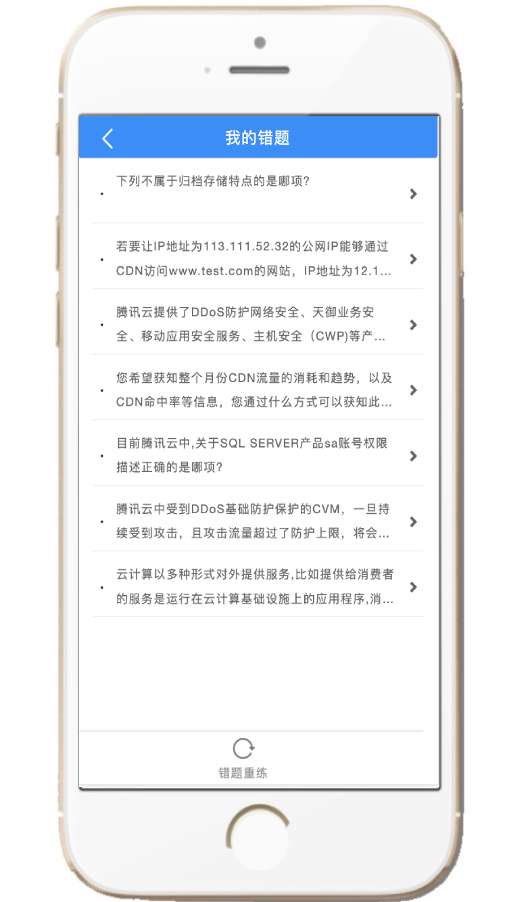

# 在线刷题考试系统 pc端移动端，多端做题记录实时同步

#### 功能介绍
#### 适用机构场景：
     在线考试系统适用于企业考核、员工职评测、培训机构考证刷题等场景；
#### 用户端功能：
     【顺序练习】，【真题模拟】，【我的错题】，【我的收藏】、【错题重练(答对自动移除错题)】、【收藏夹题目练习】、【解析查看】等；
#### 后端功能：
                  1 - 主页实时各类统计数据展示大屏
                  2 - 试卷管理（试卷的增、删、改、查）
                  3 - 题库管理（单选、多选、判断、填空等的增删改查，固定组卷、抽题组卷、随机组卷）
                  4 - 教师管理 （教师的增删改查、微信解绑）
                  5 - 学员管理 
                     5.1 - 学员账号管理（增删改查、清空做题记录、微信解绑）
                     5.2 - 学员做题记录查看
                  6 - 科目管理
                  7 - 系统管理
                      7.1 - 新闻公告发布
                      7.2 - 角色管理
                      7.3 - 菜单管理
                      7.4 - 基础参数配置
                      7.5 - 广告推荐管理 
                          - 功能持续增加中...

#### 运行环境

Java 1.8
Mysql 5.7+

#### 微信

 

#### QQ（搜索：153768392）

#### 学员移动前端效果图

  &nbsp;&nbsp;&nbsp;&nbsp;

  &nbsp;&nbsp;&nbsp;&nbsp;

  &nbsp;&nbsp;&nbsp;&nbsp;

  

#### 学员PC前端效果图

学员首页 

试卷列表 

我的错题 

我的收藏 

开始刷题 

错题重练 

#### 管理员后台管理端

管理员首页 

试卷管理（固定组卷、抽题组卷、随机组卷） 

题库管理  

学员管理  

角色管理 

